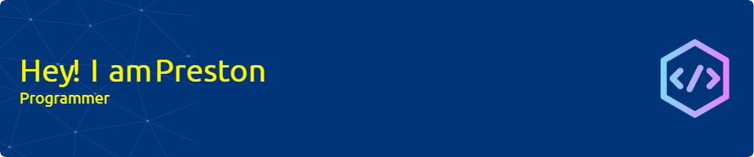

<h1 align="center">Hi 👋, I'm Preston Kostioukov</h1>
<h3 align="center">A passionate programmer from New York City</h3>

  

- 🔭 I’m currently working on **a hybrid CPU-GPU order book**

- 🌱 I’m currently learning **competitive programming**

- ⚡ Fun fact **I run competitively**

<h3 align="left">Connect with me:</h3>

<h3 align="left">Languages and Tools:</h3>

           

&nbsp;

